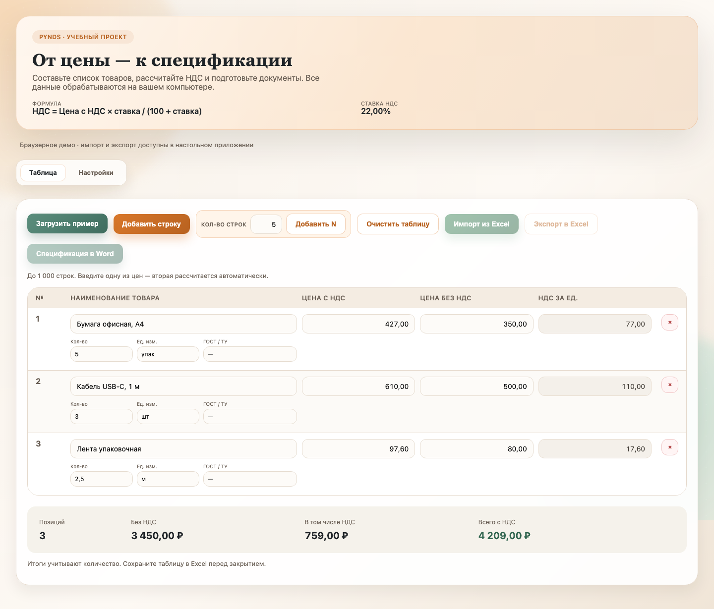
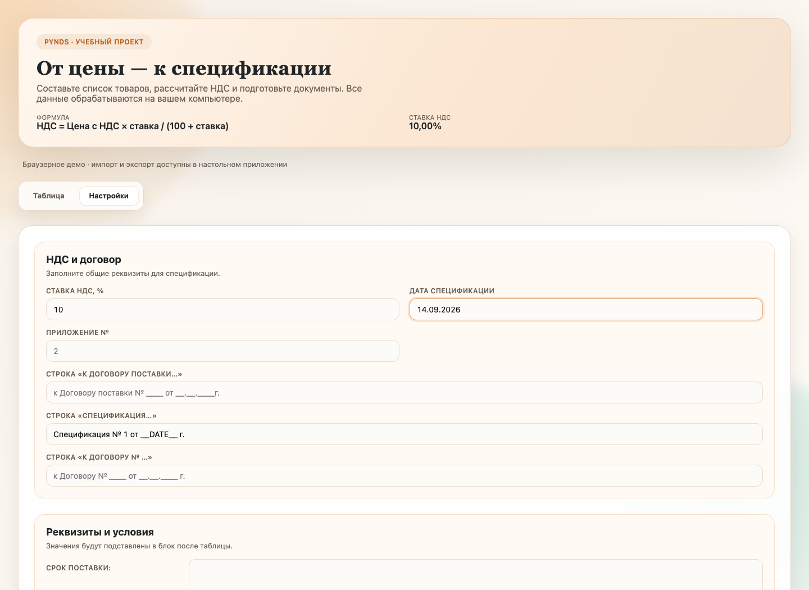

<p align="center">
  
</p>

<h1 align="center">PyNDS</h1>

<p align="center">
  <strong>От цены — к спецификации</strong><br>
  Учебно-демонстрационное настольное приложение для расчёта НДС,<br>
  работы с товарами и подготовки документов Excel и Word
</p>

<p align="center">
  <a href="#быстрый-старт">Быстрый старт</a> ·
  <a href="#демонстрационный-сценарий">Демонстрация</a> ·
  <a href="docs/architecture.md">Архитектура</a> ·
  <a href="docs/calculations.md">Правила расчёта</a> ·
  <a href="docs/development.md">Разработка и сборка</a>
</p>

<p align="center">
  
  
  
  <a href="LICENSE"></a>
  <a href="https://github.com/nickihysterics/NDS-Calculator/actions/workflows/checks.yml"></a>
</p>

## О проекте

**PyNDS** показывает полный путь небольшого прикладного инструмента: ввод данных в HTML-интерфейсе, обмен с Python через Qt WebChannel, проверка чисел, расчёт денежных сумм и создание файлов.

**Назначение:** учебный пример, демонстрация в портфолио и основа для самостоятельных упражнений.<br>
**Формат:** локальное настольное приложение без сервера, базы данных и регистрации.<br>
**Статус:** исходный код демонстрационной версии 1.0.0. Готовый установщик этой версии не поставляется.

Ставка задаётся пользователем; **22% — начальное значение учебного сценария**, а не автоматическое определение применимой ставки. Программа не учитывает налоговые режимы, льготы, даты операций и требования к регламентированной отчётности. Учебная спецификация не заменяет бухгалтерскую систему.

## Интерфейс

Тёплая палитра, зелёные акценты, редактируемые цены и итоговый блок. Скриншоты сняты с реального HTML-интерфейса в браузерном демо; в настольном приложении дополнительно работают файловые диалоги и сохранение настроек.



<details>
  <summary><strong>Настройки договора и спецификации</strong></summary>
  <br>
  
</details>

## Возможности

| Раздел | Что можно сделать |
| --- | --- |
| Товары | Добавить и удалить строки, указать количество, единицу измерения и ГОСТ / ТУ |
| Расчёт | Ввести цену с НДС или без НДС; сохранить выбранную цену при изменении ставки |
| Итоги | Увидеть число позиций, сумму без НДС, НДС и общую стоимость с учётом количества |
| Демонстрация | Заполнить таблицу тремя учебными товарами одной кнопкой |
| Excel | Импортировать активный лист с русскими или английскими заголовками; выгрузить полную таблицу |
| Word | Сформировать альбомную спецификацию A4 с реквизитами, условиями и подписями |
| Настройки | Автоматически сохранить поля договора в пользовательскую папку |
| Проверка ввода | Обнаружить неверные числа и недопустимое количество; подтвердить замену таблицы и закрытие окна |

После установки приложение работает без интернета. Шрифты системные, интерфейс и иконка входят в репозиторий, обращения к внешним ресурсам из Qt отключены.

## Быстрый старт

Нужны **Python 3.12 или 3.13**, Git и графическая среда. Интернет требуется для установки зависимостей. Команды запускайте из корня проекта.

```bash
git clone https://github.com/nickihysterics/NDS-Calculator.git
cd NDS-Calculator
python -m venv .venv
```

Активируйте окружение:

```powershell
# Windows PowerShell
.venv\Scripts\Activate.ps1
```

```bash
# macOS / Linux
source .venv/bin/activate
```

Установите зависимости и запустите окно:

```bash
python -m pip install -r requirements.txt
python src/app.py
```

На macOS / Linux команда создания окружения может называться `python3`. В Windows можно использовать `py -3.12 -m venv .venv`. Если PowerShell запрещает активацию, выполните `.venv\Scripts\python.exe -m pip install -r requirements.txt` и `.venv\Scripts\python.exe src/app.py` без изменения политики системы.

**Посмотреть интерфейс без установки Python:** откройте [src/ui/index.html](src/ui/index.html) из локальной копии в современном браузере. Расчёт и пример работают; импорт, экспорт и сохранение настроек доступны в настольной версии. Для Node.js нет роли в запуске приложения — он нужен только для тестов.

## Демонстрационный сценарий

1. Запустите приложение и нажмите **«Загрузить пример»**. Используются только вымышленные данные.
2. Проверьте начальные итоги при ставке 22%:

   | Товар | Количество | Цена без НДС | Цена с НДС | Сумма с НДС |
   | --- | ---: | ---: | ---: | ---: |
   | Бумага офисная, А4 | 5 упак | 350,00 | 427,00 | 2 135,00 |
   | Кабель USB-C, 1 м | 3 шт | 500,00 | 610,00 | 1 830,00 |
   | Лента упаковочная | 2,5 м | 80,00 | 97,60 | 244,00 |

   **Без НДС: 3 450,00 ₽ · НДС: 759,00 ₽ · Всего: 4 209,00 ₽.**

3. Измените количество или одну из цен: итог обновится сразу.
4. На вкладке **«Настройки»** заполните учебные реквизиты. В строке спецификации можно использовать `__DATE__`: при экспорте он заменяется датой из поля «Дата спецификации».
5. Выгрузите Excel, затем импортируйте его обратно. Количество и суммы сохранятся, строка «Итого» не станет товаром. При повторном импорте используйте ту же ставку.
6. Создайте Word-спецификацию и откройте её в редакторе документов.

Чтобы получить отдельный Excel для проверки импорта:

```bash
python scripts/make_example.py
```

Результат: `.local/examples/products.xlsx`. Исходные данные доступны в [examples/products.json](examples/products.json).

## Как считаются деньги

Базовые формулы при ставке `r`:

```text
Цена с НДС  = Цена без НДС × (1 + r / 100)
Цена без НДС = Цена с НДС / (1 + r / 100)
НДС за единицу = Цена с НДС − Цена без НДС
Сумма строки = Округлённая цена за единицу × Количество
```

Обе цены округляются до копеек по **ROUND_HALF_UP**, количество — до трёх десятичных знаков. Последнее редактируемое поле определяет исходную цену. Python использует `Decimal`, JavaScript — целые числа `BigInt`; общий набор контрольных примеров проверяет совпадение результатов. Подробности и пограничные случаи: [правила расчёта](docs/calculations.md).

## Excel и Word

**Импорт Excel:** `.xlsx`, `.xlsm`, `.xltx`, `.xltm`; только активный лист. Заголовки ищутся в первых 15 строках и 50 колонках. Без распознанной шапки ожидается порядок: наименование, цена без НДС, цена с НДС, НДС. Формулы не вычисляются: читается последнее значение, сохранённое Excel или LibreOffice. Старый формат `.xls` не поддерживается.

**Экспорт Excel:** номер, наименование, ГОСТ / ТУ, единица измерения, количество, обе цены, НДС за единицу и обе суммы строки. Внизу — итоги, сверху — фильтр и закреплённая шапка. Названия записываются как текст, даже если начинаются с `=`. Ставка указана в примечании к заголовку НДС; она не меняет текущую ставку при импорте.

**Экспорт Word:** альбомный A4, таблица с ценами и количеством, общая стоимость, НДС, условия поставки и блоки подписей. Итоги берутся из повторного расчёта Python. Разбиение длинных документов на страницы зависит от редактора и установленных шрифтов.

## Хранение данных

Таблица существует **до закрытия окна**. Сохраните её в Excel для продолжения работы; Word предназначен для представления спецификации. Приложение спрашивает подтверждение перед закрытием непустой таблицы.

Настройки сохраняются отдельно от кода:

| Система | Путь |
| --- | --- |
| Windows | `%APPDATA%/PyNDS/spec_settings.json` |
| macOS | `~/Library/Application Support/PyNDS/spec_settings.json` |
| Linux | `${XDG_CONFIG_HOME:-~/.config}/pynds/spec_settings.json` |

Для изолированного запуска задайте переменную `PYNDS_SETTINGS_DIR`. Шаблон в `src/spec_settings.json` содержит только пустые реквизиты. Запись настроек атомарная; повреждённый JSON заменяется значениями по умолчанию при чтении. Экспортированные документы хранятся там, где вы указали в диалоге.

## Структура проекта

```text
src/
  app.py                 Окно Qt и запуск
  backend.py             WebChannel, диалоги, обработка ошибок
  calculations.py        Проверка данных и Decimal-расчёты
  excel_io.py             Импорт и экспорт Excel
  word_export.py         Word-спецификация
  settings_store.py      Пользовательские настройки
  constants.py           Константы и словарь заголовков
  utils.py               Числа и распознавание колонок
  spec_settings.json     Шаблон реквизитов
  ui/                    HTML, CSS, JavaScript, SVG-иконка
examples/                Учебные входные данные
scripts/                 Проверки интерфейса и генерация примера
tests/                   Тесты Python и JavaScript
docs/                    Архитектура, расчёты, разработка, скриншоты
.github/                 CI и шаблоны обращений
```

## Проверки качества

```bash
python -m pip install -r requirements-dev.txt
python -m pytest
ruff check src tests scripts
ruff format --check src tests scripts
node --test tests/calculator.test.cjs
```

Для проверки интерфейса:

```bash
python -m playwright install chromium
python scripts/check_ui.py
python scripts/check_desktop.py
```

CI запускает Python-тесты на Windows, Linux и macOS, проверяет стиль, расчёты JavaScript и браузерные сценарии. Локально также проверено настоящее окно Qt WebEngine с WebChannel. Матрица и команды находятся в [checks.yml](.github/workflows/checks.yml).

## Что можно изучить и расширить

Проект подходит для знакомства с разделением интерфейса и предметной логики, десятичной арифметикой, обработкой файлов и тестированием пограничных случаев. В [архитектуре](docs/architecture.md) есть порядок чтения исходников, а в [руководстве разработчика](docs/development.md) — учебные задания и инструкция по Windows-сборке.

Текущие границы: одна ставка на всю спецификацию, до 1 000 товарных строк и до 1 трлн рублей на документ, нет базы документов, автосохранения таблицы, электронных подписей и интеграции с учётными системами. Windows-сборку необходимо отдельно проверить на целевой машине; этот релиз публикует исходники.

## Участие и лицензия

Ошибки и предложения: [GitHub Issues](https://github.com/nickihysterics/NDS-Calculator/issues). Порядок работы описан в [CONTRIBUTING.md](CONTRIBUTING.md), изменения — в [CHANGELOG.md](CHANGELOG.md).

Исходный код, документация и собственная SVG-иконка распространяются под [MIT License](LICENSE). Зависимости сохраняют свои лицензии; при распространении сборки Qt необходимо учитывать условия Qt for Python.
