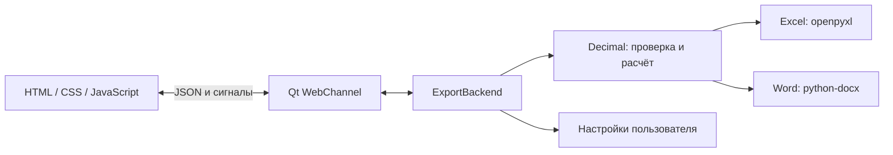

# Архитектура PyNDS

## Поток данных

`app.py` создаёт `QApplication`, окно, `QWebEngineView` и `QWebChannel`. Локальная страница получает объект `backend`; операции с файлами доступны только через объявленные Python-слоты. Программа не запускает HTTP-сервер и не ищет исполняемый интерфейс в чужих временных каталогах.

## Границы модулей

- **Интерфейс:** ввод, выбор последней редактируемой цены, предварительные расчёты, итоги и подтверждение замены таблицы. Текст товаров вставляется через `input.value`, а не через HTML.
- **`calculator.js`:** точная арифметика без DOM, доступна тестам Node.js.
- **`backend.py`:** JSON, вызовы предметной логики, файловые диалоги и сообщения пользователю. Ошибка валидации останавливает экспорт до открытия диалога сохранения.
- **`calculations.py`:** источник правил экспорта. Полученные от интерфейса цены, количество и суммы перепроверяются; готовые суммы клиента не считаются доверенными.
- **`excel_io.py`:** ограниченный просмотр шапки, чтение активного листа, текстовые ячейки и оформление выгрузки. Книга закрывается даже при ошибке чтения.
- **`word_export.py`:** представление нормализованных строк и реквизитов. Ширины сетки задаются до объединения ячеек.
- **`settings_store.py`:** значения по умолчанию, фильтрация структуры настроек и атомарная запись в пользовательскую папку.

## Протокол WebChannel

| Направление | Метод / сигнал | Содержимое |
| --- | --- | --- |
| JS → Python | `requestSettings()` | Запрос текущих настроек |
| Python → JS | `settingsReady(str)` | JSON настроек |
| JS → Python | `saveSettings(str)` | JSON настроек |
| Python → JS | `settingsSaved(bool, str)` | Результат и сообщение |
| JS → Python | `importExcel()` | Открытие диалога импорта |
| Python → JS | `importDataReady(str)` | `{ "rows": [...] }` с нормализованными строками |
| JS → Python | `exportExcel(str)` / `exportWord(str)` | `{ "vatRate": "22", "rows": [...], "settings": {...} }` |

Денежные значения в JSON передаются строками. При импорте используется сохранённая ставка приложения; интерфейс затем пересчитывает данные по текущему полю ставки. Ставку следует выбрать до импорта. При открытии окна автосохранение не запускается до получения настроек; подтверждение предыдущего сохранения не отменяет новую отложенную запись.

## Жизненный цикл данных

Таблица живёт в DOM до закрытия окна. Экспорт Excel — способ сохранить её между сеансами. Настройки автоматически сохраняются через 600 мс после ввода; при закрытии окна выполняется завершающее сохранение. При замене непустой таблицы и закрытии окна пользователь подтверждает действие.

UI использует только локальные ресурсы, включая SVG-иконку и системные шрифты. У браузерного демо нет Python-моста, поэтому файловые кнопки отключены и режим явно подписан.

## Порядок изучения

1. Запустить пример и проверить итоги по README.
2. Прочитать `calculations.py` и общие тестовые случаи.
3. Сравнить реализацию `calculator.js` с правилами Decimal.
4. Проследить `requestExport → exportExcel → normalize_rows → write_excel`.
5. Разобрать сигналы настроек, затем импорт заголовков и Word-таблицу.

## Осознанные упрощения

Файловые операции выполняются синхронно в GUI-потоке. Ограничение в 1 000 товаров и 10 000 строк входного листа делает сценарий предсказуемее, но крупные файлы всё равно могут кратковременно задержать окно. Следующий шаг при расширении проекта — рабочий поток с прогрессом и отменой. В проекте нет базы данных, сетевых интеграций или скрытого фонового сервиса.
